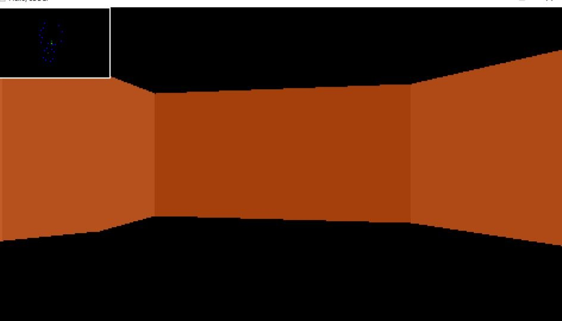
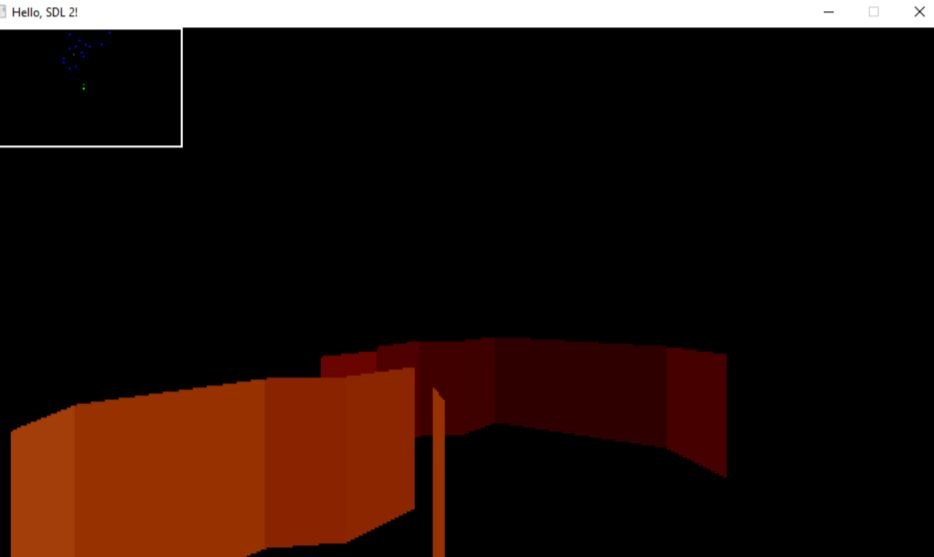
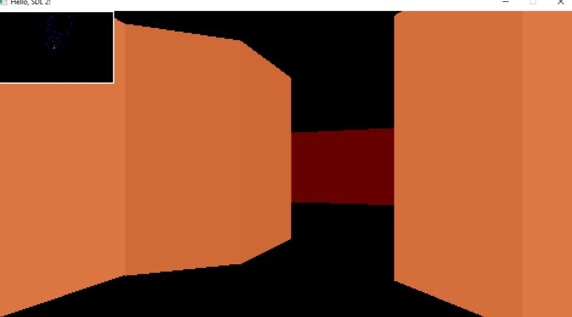

# DoomShooter

Doom-подобный движок на SDL2 (не рейкастер)

## Особенности (поздняя версия)

* Стены разной высоты
* Шестиугольные фигуры
* Цветное небо и фигуры

## Скриншоты ранней версии

## Технологии

- C++
- SDL2
